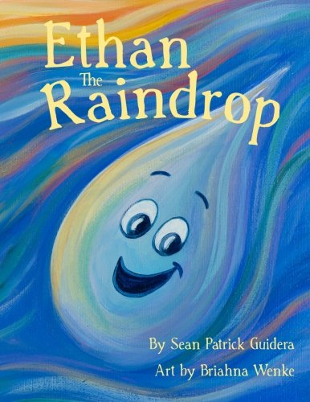

## README

This is an app I created to market my friend's book, which is called "Ethan the Raindrop."  It's delightful!

If you'd like to help, please feel free!



* Ruby version - 2.4.5

* Rails version - 5.2.3

## Getting Started

To run the Imagine Challenge on your local machine, navigate to the directory in which you would like the project to be located, then execute the following commands:

```
$ git clone
git@github.com:le3ah/ethan_the_raindrop.git
$ cd ethan_the_raindrop
$ bundle
$ rails g rspec:install
$ rails db:create
$ rails db:migrate
```

## Deployment

To view this app in development, execute the following command from the project directory: `rails s`. In a browser, visit `localhost:3000`, to view the application.

The live view is deployed on Heroku at http://ethan-the-raindrop.herokuapp.com/.

Development & test environment gems I added include the following:
* gem 'rspec-rails'
* gem 'capybara'
* gem 'launchy'
* gem 'pry'
* gem 'shoulda-matchers', '~> 3.1'
* gem 'simplecov'

## Testing

I ran my tests using the command `rspec` and tracked my coverage through `SimpleCov`

## Author
[Leah K. Miller](https://github.com/le3ah)
